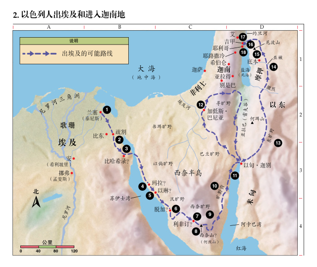

# 出埃及记 15

## 出埃及的可能路线

## 摩西之歌 （1-18）
* 本章记载了过红海的以色列人怀着满溢的感谢和喜乐，向主高歌，赞美神的大能和拯救，把荣耀归给神的场面。
- 在他們所唱的歌中，有回顧，也有前瞻。回顧已往，他們看見祂已經榮耀的得勝，一切與祂為敵和反對他們的權勢，已經在祂全能的作為之下，顯為軟弱。展望前途，他們認識神的旨意和權能；祂必要成全祂的旨意，把他們帶進並栽在祂產業的山上。―― 摩根《話中之光》
* 這歌的中心，乃是神。
* 这首歌要在玻璃海唱出，就如曾在红海上唱出来一样（启一五2,3）。
> 15:2 我看见彷佛有玻璃海，其中有火搀杂。又看见那些胜了兽和兽的像，并它名字数目的人，都站在玻璃海上，拿着　神的琴，  
> 15:3 唱　神仆人摩西的歌和羔羊的歌，说：“主　神，全能者啊，你的作为大哉，奇哉！万世之王啊（注：“世”或作“国”），你的道途义哉，诚哉！

***
### 耶和华得胜 (1)
#### 15:1 那时，摩西和以色列人向耶和华唱歌说：“我要向耶和华歌唱，因他大大战胜，将马和骑马的投在海中。
- 以色列人此时的属灵光景就像一个刚刚蒙恩得救的人，敬拜的情绪很高，感谢和赞美也真诚，但属灵的认识和经历仍然在低处。这个低处的敬拜所根据的完全是「因祂大大战胜，将马和骑马的投在海中」。
- 只有「凭着信心，不是凭着眼见」（林后五7）发出的感谢和赞美，才是信心高处的敬拜，
> 林后5:7: 因为我们行事是凭着信心，不是凭着眼见.

- 这是每个信徒属灵成长的必经的道路，我们和以色列人一样，也都要经过低处的经历和认识，然后再慢慢升到信心的高处。

***
### 他是什么：力量、诗歌、拯救。(2-3)  
#### 15:2 耶和华是我的力量、我的诗歌，也成了我的拯救。这是我的　神，我要赞美他；是我父亲的　神，我要尊崇他。

#### 15:3 耶和华是战士，他的名是耶和华。

***
### 他作了何事：战胜过往的敌人；拯救他的民脱离埃及 (4-13)
#### 15:4 法老的车辆、军兵，耶和华已抛在海中，他特选的军长都沉于红海。

#### 15:5 深水淹没他们，他们如同石头坠到深处。

#### 15:6 耶和华啊，你的右手施展能力，显出荣耀；耶和华啊，你的右手摔碎仇敌。
* 右边象征着权柄和能力。耶稣洗净我们的罪后，就坐在全能父上帝的右边（来1：3）。
> 1:3 他是神荣耀所发的光辉，是神本体的真像，常用他权能的命令托住万有。他洗净了人的罪，就坐在高天至大者的右边。
* "右手": 比喻力量

#### 15:7 你大发威严，推翻那些起来攻击你的；你发出烈怒如火，烧灭他们像烧碎秸一样。

#### 15:8 你发鼻中的气，水便聚起成堆，大水直立如垒，海中的深水凝结。
* 鼻中的气, 指神赐下那场「大东风」（十四21）
> 14:21 摩西向海伸杖，耶和华便用大东风，使海水一夜退去，水便分开，海就成了乾地。

#### 15:9 仇敌说：‘我要追赶，我要追上；我要分掳物，我要在他们身上称我的心愿。我要拔出刀来，亲手杀灭他们。’

#### 15:10 你叫风一吹，海就把他们淹没；他们如铅沉在大水之中。

#### 15:11 耶和华啊，众神之中谁能像你？谁能像你至圣至荣，可颂可畏，施行奇事？
* 众神(gods, not God): 指的是那些被当成神来敬拜的偶像、假神。

#### 15:12 你伸出右手，地便吞灭他们。

#### 15:13 你凭慈爱领了你所赎的百姓；你凭能力引他们到了你的圣所。

***
### 他将要作何事：战胜将来的敌人；带领他的民进入他们的产业地。(14-18)
#### 15:14 外邦人听见就发颤，疼痛抓住非利士的居民；
#### 15:15 那时，以东的族长惊惶，摩押的英雄被战兢抓住，迦南的居民心都消化了。
#### 15:16 惊骇恐惧临到他们。耶和华啊，因你膀臂的大能，他们如石头寂然不动，等候你的百姓过去，等候你所赎的百姓过去。
* 非利士、以东、摩押和迦南人都惊骇恐惧

#### 15:17 你要将他们领进去，栽于你产业的山上。耶和华啊，就是你为自己所造的住处；主啊，就是你手所建立的圣所。
* 「产业」即迦南应许之地。「圣所」指敬拜神的地方。

#### 15:18 耶和华必作王，直到永永远远！”

#### 15:19 法老的马匹、车辆和马兵下到海中，耶和华使海水回流淹没他们，惟有以色列人在海中走乾地。

#### 15:20 亚伦的姐姐女先知米利暗，手里拿著鼓，众妇女也跟她出去拿鼓跳舞。
* 米利暗是圣经中提到的第一位女先知. 她是亚伦和摩西的姐姐.

#### 15:21 米利暗应声说：“你们要歌颂耶和华，因他大大战胜，将马和骑马的投在海中。”
* 与摩西之歌的第一句几乎相同（1节）.可能是米利暗带领妇女们唱的副歌。

***
## 书珥旷野
* 第22节开始，记载从红海到西乃山的旅程。（一五22～一八27）
* 书珥的旷野(找不到水) --> 玛拉(水苦)--> 以琳(十二股水泉，七十棵棕树).

#### 15:22 摩西领以色列人从红海往前行，到了书珥的旷野，在旷野走了三天，找不著水。

#### 15:23 到了玛拉，不能喝那里的水，因为水苦，所以那地名叫玛拉。
* "玛拉"： 苦

#### 15:24 百姓就向摩西发怨言，说：“我们喝甚么呢？”
* 刚刚经历了神奇妙大能的以色列人，受苦的一瞬间就忘了神的救恩。三天后遇到一个小小的困难：玛拉的苦水，又开始抱怨，显现出以色列的婴孩信仰：施恩就喜乐，有苦难就埋怨。
* 我们是否也常常埋怨圣灵为什么会带领我们走到这样山穷水尽的地步？
* 我们在得救的时候也会献上赞美和感恩，但是否在之后的试炼中能够信靠神，在苦难中也赞美感谢主？

#### 15:25 摩西呼求耶和华，耶和华指示他一棵树，他把树丢在水里，水就变甜了。耶和华在那里为他们定了律例、典章，在那里试验他们。
* "呼求"与"哀求"（十四15）是同一个字(crying out)  
> 14:15 耶和华对摩西说：“你为什么向我哀求呢？你吩咐以色列人往前走。
* "树"： 象征着十字架. 把生命中的苦楚转化为甘甜。

#### 15:26 又说：“你若留意听耶和华你　神的话，又行我眼中看为正的事，留心听我的诫命，守我一切的律例，我就不将所加与埃及人的疾病加在你身上，因为我耶和华是医治你的。”
* 经历了拯救，得着了自由，但并不是没有了约束。
* 神把甜水和「律例、典章」一起赐给他们，让他们从听从「神的话」开始，学习认识神的心意、接受神的权柄，活在「神的话」里。
* 「神的话」就是神的权柄和能力. 使红海分开的不是摩西的「杖」（十四16），而是「神的话」；使苦水变甜的不是那棵「树」，也是「神的话」. 把信心建立在「神的话」上，而不是眼见的事实和过去的经验上。
* 主耶稣刚刚在约旦河受洗，也立刻「被圣灵引到旷野，受魔鬼的试探」（太四1）。同样面对试探，主耶稣「靠神口里所出的一切话」而得胜（太四4）。
> 4:1 当时，耶稣被圣灵引到旷野，受魔鬼的试探。  
> 4:4 耶稣却回答说：“经上记着说：‘人活着，不是单靠食物，乃是靠　神口里所出的一切话。’”

#### 15:27 他们到了以琳，在那里有十二股水泉，七十棵棕树，他们就在那里的水边安营。
* 「十二股水泉」可能象征十二支派，「七十棵棕树」可能象征雅各家七十人下埃及（一5）
> 1:5 凡从雅各而生的，共有七十人；约瑟已经在埃及。
* 指出我们来到十字架后。便能享受安息，重新得力。
