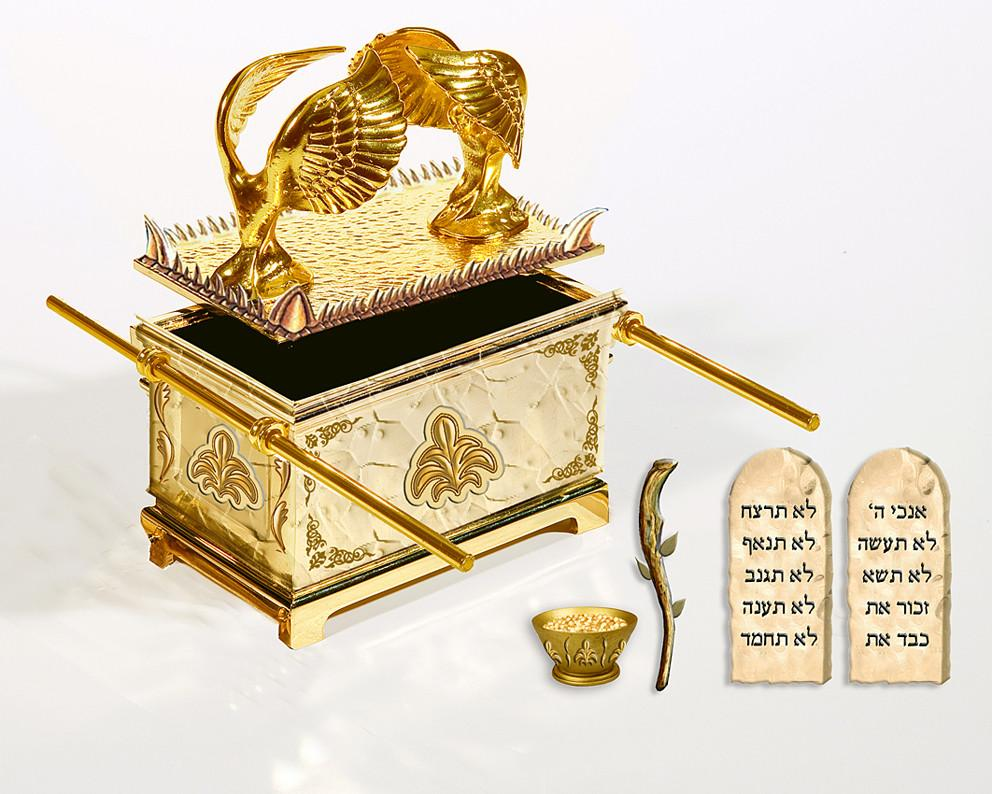

# 出埃及记 16

## 吗哪与鹌鹑
#### 16:1 以色列全会众从以琳起行，在出埃及后第二个月十五日，到了以琳和西奈中间、汛的旷野。  
- 以色列若在一月十五日離開埃及，當天便是出埃及之後一整月。

***
#### 16:2 以色列全会众在旷野向摩西、亚伦发怨言，　　  
#### 16:3 说：“巴不得我们早死在埃及地耶和华的手下；那时我们坐在肉锅旁边，吃得饱足。你们将我们领出来，到这旷野，是要叫这全会众都饿死啊！”  
- 过去两次「以色列全会众」是向摩西发怨言（十四11；十五24），现在第三次是向摩西、亚伦和神发怨言（3节）
- 埃及地： 为奴之地。
> 那时我们坐在肉锅旁边，吃得饱足。  
> 民11:5 我们记得在埃及的时候，不花钱就吃鱼，也记得有黄瓜、西瓜、韭菜、葱、蒜。

- 以色列众人没有认定神的带领，愚昧地说「你们将我们领出来」
- 以色列人已经借着「十灾」认识了神，「过红海」经历了救恩，在「玛拉」领受过神的话语（十五25），在「以琳」享用过神的安息（十五27），但一遇到困难就抱怨。表明他们始终是活在自己的满足里，而不是活在「神的话」（十五26）里。他们的信心还不是建立在「神的话」（十五26）上，而是建立在眼见的事实和过去的经验上；还没有多少「神的话」（十五26）真正进到他们的生命里，所以他们里面充满的是「肉体的私欲」（彼前二11），发出来的是「怨言」而不是祷告。
- 今天神的子民，也常因遭遇一些微不足道的事而发怨言。

***
#### 16:4 耶和华对摩西说：“我要将粮食(bread)从天降给你们。百姓可以出去，每天收每天的份，我好试验他们遵不遵我的法度。  
#### 16:5 到第六天他们要把所收进来的预备好了，比每天所收的多一倍。”　
- 当祂的百姓还「在基督里为婴孩」（林前三1）的时候，祂不是用公义来追讨人的愚昧，却是用丰富的恩典来「试验他们」（4节）、扶持他们，让他们在恩典里被造就，把信心建立在「神的话」（十五26）上。

#### 16:6 摩西、亚伦对以色列众人说：“到了晚上，你们要知道是耶和华将你们从埃及地领出来的。  
- 神用丰富的恩典和供应让这些不配的人「知道是耶和华将你们从埃及地领出来的」.

#### 16:7 早晨，你们要看见耶和华的荣耀，因为耶和华听见你们向他所发的怨言了。我们算甚么，你们竟向我们发怨言呢？”  
#### 16:8 摩西又说：“耶和华晚上必给你们肉吃，早晨必给你们食物得饱，因为你们向耶和华发的怨言，他都听见了。我们算甚么？你们的怨言不是向我们发的，乃是向耶和华发的。”  
- 在神所带领的路上发怨言，「乃是向耶和华发的」，实际上是对神没有信心。

#### 16:9 摩西对亚伦说：“你告诉以色列全会众说：‘你们就近耶和华面前，因为他已经听见你们的怨言了。’”  
#### 16:10 亚伦正对以色列全会众说话的时候，他们向旷野观看，不料，耶和华的荣光在云中显现。  
- 这是「耶和华的荣光」第一次向全体「以色列全会众」显现，向百姓显明，带领他们的不是人、而是神自己。

#### 16:11 耶和华晓谕摩西说：“  
#### 16:12 我已经听见以色列人的怨言，你告诉他们说：‘到黄昏的时候，你们要吃肉，早晨必有食物得饱，你们就知道我是耶和华你们的　神。’”  

***
#### 16:13 到了晚上，有鹌鹑飞来，遮满了营。早晨，在营四围的地上有露水。
- 鹌鹑是一種候鳥.移棲在南歐洲和阿拉伯之間，途經西奈半島。鵪鶉約在三四月間，即逾越節後不久往北遷徙，牠們疲倦時連遊牧民族的黑色矮帳都不能越過，落地之後亦無法再度起飛。身手靈活的孩子，很容易便能捉到在地上奔跑的鵪鶉。

#### 16:14 露水上升之后，不料，野地面上有如白霜的小圆物。  
#### 16:15 以色列人看见，不知道是甚么，就彼此对问说：“这是甚么呢？”摩西对他们说：“这就是耶和华给你们吃的食物。  
- "這是什麼呢？": “吗哪”这个名字来自于组成这个问题的希伯来词汇。。

#### 16:16 耶和华所吩咐的是这样：你们要按著各人的饭量，为帐棚里的人按著人数收起来，各拿一俄梅珥。”  
- 一「俄梅珥」大约是2.2公升。体积参考2公升装的百事/可乐。

#### 16:17 以色列人就这样行；有多收的，有少收的。  
#### 16:18 及至用俄梅珥量一量，多收的也没有余，少收的也没有缺；各人按著自己的饭量收取。  
- 可能是將收集起來的嗎哪集中分配。保羅在哥林多後書八章14、15節是這樣解釋：
> 8:14 乃要均平，就是要你們的富餘，現在可以補他們的不足，使他們的富餘，將來也可以補你們的不足，這就均平了。  
> 8:15 如經上所記：多收的也沒有餘；少收的也沒有缺。

#### 16:19 摩西对他们说：“所收的，不许甚么人留到早晨。”  
#### 16:20 然而他们不听摩西的话，内中有留到早晨的，就生虫变臭了；摩西便向他们发怒。  
#### 16:21 他们每日早晨，按著各人的饭量收取，日头一发热，就消化了。  

***
#### 16:22 到第六天，他们收了双倍的食物，每人两俄梅珥。会众的官长来告诉摩西。   
#### 16:23 摩西对他们说：“耶和华这样说：‘明天是圣安息日，是向耶和华守的圣安息日，你们要烤的就烤了，要煮的就煮了，所剩下的都留到早晨。’”  
- 这是圣经中第一次正式提到安息日。
> 創世記二章2、3节：  
> 2:2 到第七日，神造物的工已經完畢，就在第七日歇了他一切的工，安息了。  
> 2:3 神賜福給第七日，定為聖日；因為在這日，神歇了他一切創造的工，就安息了。

#### 16:24 他们就照摩西的吩咐留到早晨，也不臭，里头也没有虫子。
- 神迹：吗哪既没有融化，也没有变坏。

#### 16:25 摩西说：“你们今天吃这个吧！因为今天是向耶和华守的安息日，你们在田野必找不著了。  
#### 16:26 六天可以收取，第七天乃是安息日，那一天必没有了。”  
#### 16:27 第七天百姓中有人出去收，甚么也找不著。  
#### 16:28 耶和华对摩西说：“你们不肯守我的诫命和律法要到几时呢？  
#### 16:29 你们看！耶和华既将安息日赐给你们，所以第六天他赐给你们两天的食物，第七天各人要住在自己的地方，不许甚么人出去。”  
#### 16:30 于是，百姓第七天安息了。
- 定立安息日的律例。日后，这律例成为十诫之一。
- 虽然摩西一再告诫，还是有人心存侥幸的心理，不肯信从神的「法度」  
- 等颁布律法之后，神对干犯安息日的罪就不再容忍（民十五32-36)。
> 15:32 以色列人在旷野的时候，遇见一个人在安息日捡柴。  
> 15:33 遇见他捡柴的人，就把他带到摩西、亚伦并全会众那里，  
> 15:34 将他收在监内，因为当怎样办他，还没有指明。  
> 15:35 耶和华吩咐摩西说：“总要把那人治死，全会众要在营外用石头把他打死。”  
> 15:36 于是全会众将他带到营外，用石头打死他，是照耶和华所吩咐摩西的。  

- 安息日的属灵意义
> **歌 羅 西 書 2:16-17**:  
> 16 所 以 ， 不 拘 在 飲 食 上 ， 或 節 期 、 月 朔 、 安 息 日 都 不 可 讓 人 論 斷 你 們 。
> 17 這 些 原 是 後 事 的 影 兒 ； 那 形 體 卻 是 基 督 。  
(解释了旧约各种节期、月朔、安息日等规条，都是预表以后要来的耶稣基督和他的救法。)
> **来4:9-10**:  
> 这样看来，必另有一安息日的安息，为神的子民存留。
> 因为那进入安息的，乃是歇了自己的工，正如神歇了他的工一样。  
(《圣经》自己对“安息日”属灵意义所作的解释)

***
#### 16:31 这食物，以色列家叫吗哪，样子像芫荽子，颜色是白的，滋味如同搀蜜的薄饼。
- 耶稣在约翰福音中，将自己比作吗哪，是我们每天的生命粮，能满足我们属灵上的需要（约六48～51）
> 6:48 我就是生命的粮。  
> 6:49 你们的祖宗在旷野吃过吗哪，还是死了。  
> 6:50 这是从天上降下来的粮，叫人吃了就不死。  
> 6:51 我是从天上降下来生命的粮；人若吃这粮，就必永远活着。我所要赐的粮，就是我的肉，为世人之生命所赐的。”  

***
#### 16:32 摩西说：“耶和华所吩咐的是这样：要将一满俄梅珥吗哪留到世世代代，使后人可以看见我当日将你们领出埃及地，在旷野所给你们吃的食物。”  
#### 16:33 摩西对亚伦说：“你拿一个罐子，盛一满俄梅珥吗哪，存在耶和华面前，要留到世世代代。”  
#### 16:34 耶和华怎么吩咐摩西，亚伦就怎么行，把吗哪放在法柜前存留。  
* “法柜”(ark of the testimony，直译作“见证的柜”), 又称“约柜”（ark of the covenant), 神与以色列人立约的象征，尤其是见证神的同在.   
* 法柜的建造（25：10-22）  
* 法柜里有什么:
> 来9:4 在原来的会幕里，第二个室内有约柜，是个包金的大木柜。柜里有盛吗哪的金罐和亚伦发过芽的杖，并两块约版。（日后兴建圣殿时，约柜里除了两块约版之外别无他物参看王上八9）。

***
#### 16:35 以色列人吃吗哪共四十年，直到进了有人居住之地，就是迦南的境界。
- 四十年：从出埃及当年的2月16日一直到出埃及第41年的1月15日。
- 整个出埃及、进迦南的过程，都是倚靠神丰富的恩典和供应。

#### 16:36 (俄梅珥乃伊法十分之一。)  

## 应用
- 为什么说刚出埃及的以色列人具有"婴孩般"的信仰,其属灵光景就像一个刚刚蒙恩得救的人?
- 我们应如何看待和面对神的试炼? 我们是否能够在试炼中信靠神，在苦难中也赞美感谢主？
- 我们对神的感谢和赞美,是凭借对神的信心,还是"眼见"? 如何表明我们的信心是建立在"神的话"上;我们是活在"神的话"里,而不是自己的满足里?
- 如何评价自己当下的属灵光景?

# Reference
- <<创世记>>描述神创造人类，拣选和赐应许给以色列人的列祖，并把雅各一家带到埃及繁殖增多。<<出埃及记>>描述神怎样藉摩西，领以色列民离开埃及为奴之地，在西乃山上与他们立约，颁布律法。<<利末记>>详细记载神启示的律法礼仪，预备他们成为祭司的国度。<<民数记>>接续下去，描述神怎样把他们组织起来，踏上旷野的旅程，在屡次反叛中管教他们，最後把他们领到应许地的边界。
- <<民数记>>是<<出埃及记>>和<<利未记>>之后记载以色列人在旷野四十年的漂泊。
