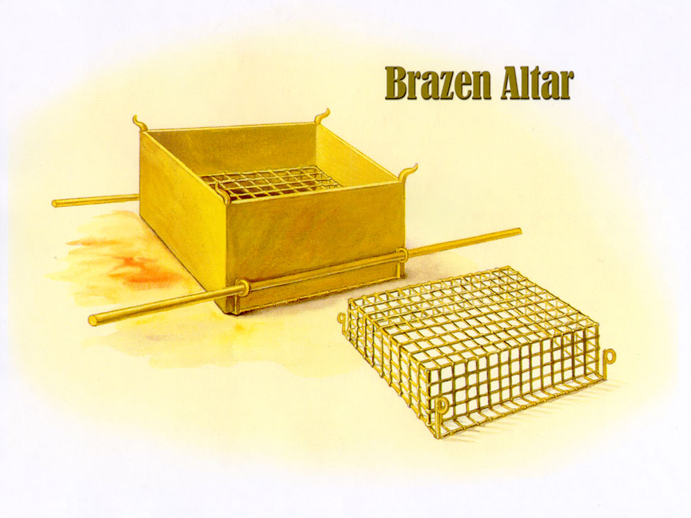
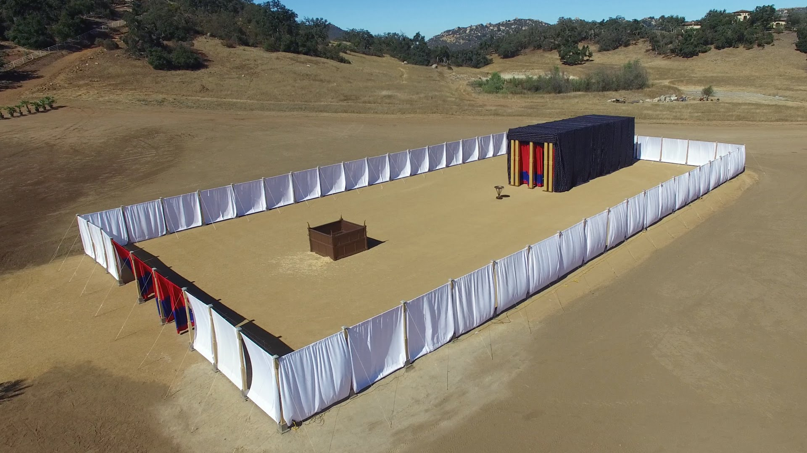

# 出埃及记 27

【燔祭坛】  (献燔祭的坛)  
- 燔祭  
是指将所献上的整只祭牲完全烧在祭坛上，全部经火烧成灰的一种祭祀仪式。
> 【利未记1:3-5】他的供物若以牛为燔祭，就要在会幕门口献一只没有残疾的公牛，可以在耶和华面前蒙悦纳。他要按手在燔祭牲的头上，燔祭便蒙悦纳，为他赎罪。他要在耶和华面前宰公牛；亚伦子孙作祭司的，要奉上血，把血洒在会幕门口坛的周围。

27:1 你要用皂荚木做坛，这坛要四方的，长五肘，宽五肘，高三肘。  
- 肘: 1肘 = 1.5ft = 46cm (44cm)。坛长2.25米，宽2.25米，高1.35米，是会幕中最大的物件。

27:2 要在坛的四拐角上做四个角，与坛接连一块，用铜把坛包裹。  
- 故坛又称"铜坛"。
- 坛角：血洒在坛角上，本来可以赎罪。在大祭司承接圣职的仪式中（利八15；九19） 、 赎罪祭 （利四18）和赎罪日（利十六18 ） ， 祭司都要用血抹在这四个角上，象征献祭的果效长远留存。  
> 【利8:15】就宰了公牛。摩西用指头蘸血，抹在坛上四角的周围，使坛洁净，把血倒在坛的脚那里，使坛成圣，坛就洁净了；   
> 【利9:9】亚伦的儿子把血奉给他，他就把指头蘸在血中，抹在坛的四角上，又把血倒在坛脚那里。  
> 【利4:18】又要把些血抹在会幕内、耶和华面前坛的四角上，再把所有的血倒在会幕门口、燔祭坛的脚那里。  
> 【利16:18 】他出来，要到耶和华面前的坛那里，在坛上行赎罪之礼，又要取些公牛的血和公山羊的血，抹在坛上四角的周围；  

- 在五个祭里，只有赎罪祭、赎愆祭要用到铜祭坛的「四个角」.这「四个角」表明祭坛的本质乃是拯救，凡到祭坛这里来的人，只要不是故意杀人，都能得着拯救（王上一50）   
> 【王上1：50】亚多尼雅惧怕所罗门，就起来，去抓住祭坛的角。

- 误杀者可以逃跑到神的坛，又或者逃到某些避难的城里。若蓄意杀人，神的坛便不作罪犯的避难所。
> 21:14 人若任意用诡计杀了他的邻舍，就是逃到我的坛那里，也当捉去把他治死。

27:3 要做盆，收去坛上的灰，又做铲子、盘子、肉叉子、火鼎；坛上一切的器具都用铜做。　  
27:4 要为坛做一个铜网，在网的四角上做四个铜环。  
27:5 把网安在坛四面的围腰板以下，使网从下达到坛的半腰。  
27:6 又要用皂荚木为坛作杠，用铜包裹。  
27:7 这杠要穿在坛两旁的环子内，用以抬坛。  
27:8 要用板做坛，坛是空的，都照着在山上指示你的样式做。  
- 「铜」象征审判。铜祭坛和坛上的一切用具都是用铜做的，表明了神公义的要求。  
- 因为罪人在神面前是站立不住的。因此神定意向人施恩，预备了铜祭坛来解决人的难处。人借着祭坛解决了在神面前的难处，才能进入帐幕享用基督。神的公义就在祭坛得着满足，神的怜悯也在祭坛得以流出，公义的祭坛就成了恩典的出口。  
- 金，银，铜　　
 - 金——预表神（基督）的荣耀（自己），因此施恩座是金的，金子也关乎人的信心。
 - 银——基督的救赎，所以没有利未人替代的长子必须花银子赎买自己。
 - 铜——代表审判，因此祭坛和洗濯盆是铜的。

【外院】  
27:9 你要做帐幕的院子，院子的南面要用捻的细麻做帷子，长一百肘。  
27:10 帷子的柱子要二十根，带卯的铜座二十个，柱子上的钩子和杆子都要用银子做。  
27:11 北面也当有帷子，长一百肘，帷子的柱子二十根，带卯的铜座二十个，柱子上的钩子和杆子都要用银子做。  
27:12 院子的西面当有帷子，宽五十肘。帷子的柱子十根，带卯的座十个。  
27:13 院子的东面要宽五十肘。  
27:14 门这边的帷子要十五肘，帷子的柱子三根，带卯的座三个；  
27:15 门那边的帷子也要十五肘，帷子的柱子三根，带卯的座三个。  
27:16 院子的门当有帘子，长二十肘，要拿蓝色、紫色、朱红色线和捻的细麻，用绣花的手工织成，柱子四根，带卯的座四个。  
- 这「帘子」的织法和材料与帐幕的门帘完全一样（26:36）  
> 26:36 你要拿蓝色、紫色、朱红色线，和捻的细麻，用绣花的手工织帐幕的门帘。

27:17 院子四围一切的柱子都要用银杆连络，柱子上的钩子要用银做，带卯的座要用铜做。  
27:18 院子要长一百肘，宽五十肘，高五肘，帷子要用捻的细麻做，带卯的座要用铜做。  
- 院子高五肘，帐幕高“十肘” (即4.5米)（26:16）.帐幕只占院中6%的面积.  
- 在外面可以远远地看见帐幕。但不进入院子，就不能享用到神所预备的赦免、恩典和荣耀。  
- 进入「院子」，就是进入基督里。人只有活在基督里，才能享用神为我们所预备的一切丰盛；人若不进到基督里，不管有多少属灵知识，还是被隔绝在神的恩典之外。

27:19 帐幕各样用处的器具，并帐幕一切的橛子和院子里一切的橛子都要用铜做。

【灯台之油】   
27:20 你要吩咐以色列人，把那为点灯捣成的清橄榄油拿来给你，使灯常常点着。  
- 「清橄榄油」指没有杂质的上等橄榄油。普通的橄榄油是用磨石压榨出来的，比较混浊；而上等的「清橄榄油」是把破碎的橄榄放在臼中，用手工慢慢「捣成」的，非常清澈，烧起来烟雾比较少。

27:21 在会幕(Tent of Meeting)中法柜(Testimony)前的幔外，亚伦和他的儿子，从晚上到早晨，要在耶和华面前经理这灯，这要作以色列人世世代代永远的定例。  

# 问题
- 上帝为什么要选择皂荚木来建造会幕及其中的物件？  
> 约柜和杠: 【出25:10] 要用皂荚木做一柜，长二肘半，宽一肘半，高一肘半。  【出25:13】要用皂荚木作两根杠，用金包裹。  
> 陳設餅的桌子和杠：【出25:23】要用皂荚木做一张桌子，长二肘，宽一肘，高一肘半。   【出25:28】要用皂荚木作两根杠，用金包裹，以便抬桌子。  
> 帐幕的竖板和联结的闩：【出26:15】你要用皂荚木做会幕的竖板。【出26:26】你要用皂荚木做闩，为帐幕这面的板作五闩。   
> 帐幕的幔子和门帘的柱子：【出26:32】要把幔子掛在四根包金的皂莢木柱子上，柱子上当有金钩，柱子安在四个带卯的银座上。  【出26:37】要用皂莢木為簾子作五根柱子，用金子包裹。柱子上当有金钩，又要为柱子用铜铸造五个带卯的座。  
> 燔祭坛和杠：【出27:1】你要用皂荚木做坛，这坛要四方的，长五肘，宽五肘，高三肘。  【出27:6】又要用皂荚木为坛作杠，用铜包裹。  
> 金香坛和杠：【出30:1】你要用皂荚木做一座烧香的坛。  【出30:5】要用皂荚木作杠，用金包裹。   

 - 皂荚木：acacia wood（原文"多刺"的意思）.它枝幹多刺，是世上少有能忍受沙漠惡劣環境的植物。其木材堅硬、耐壓又能抗蟲、防腐.  
 - 上帝只拣选合用的器皿。
 - 大凡上帝使用的人，总要经历许多的磨难。就像祂用旷野与沙漠，用干旱与炎热去训练皂荚树，为要使它成为高贵的木头，成为至圣所里最为圣洁尊贵的器皿。

# Reference
- http://www.jonahome.net/bible/CUV/exo/27.htm
- [出埃及记第27章逐节注解、祷读](https://cmcbiblereading.com/2015/03/19/%E5%87%BA%E5%9F%83%E5%8F%8A%E8%AE%B0%E7%AC%AC27%E7%AB%A0%E9%80%90%E8%8A%82%E6%B3%A8%E8%A7%A3%E3%80%81%E7%A5%B7%E8%AF%BB/)
- [燔祭坛的图片](https://j.17qq.com/article/dpcogcklv.html)  
- 铜祭坛和铜网示意图
- 铜祭坛和帐幕的院子

- 皂荚木
      
  
- 帐幕  

- [赎罪祭和赎愆祭](https://r.729ly.net/exposition/exposition-be/exposition-be-ot-pentateuch-leviticus/exposition-be-ot-pentateuch-leviticus04)
