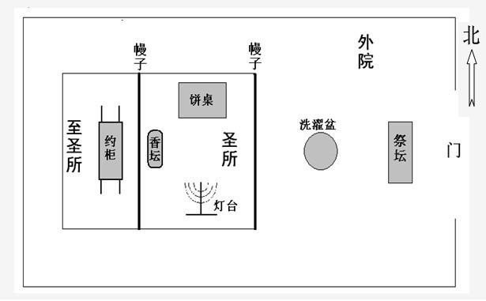
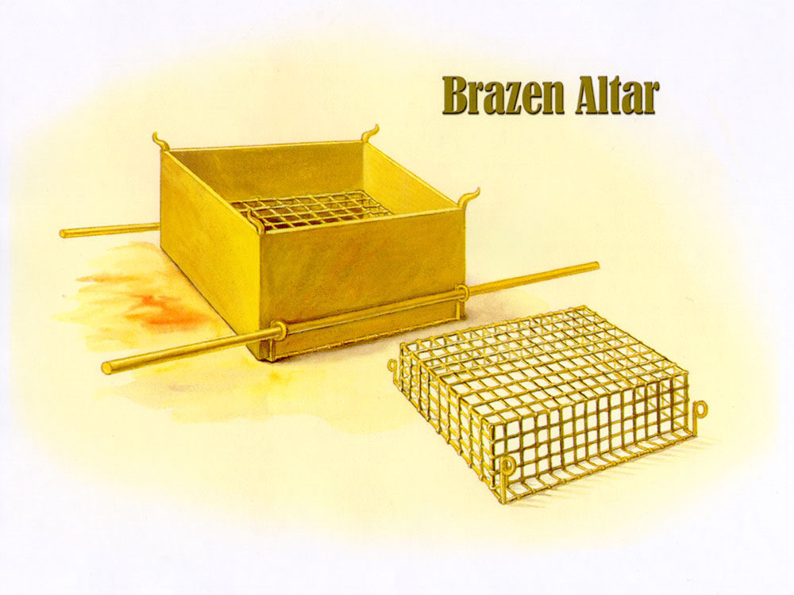
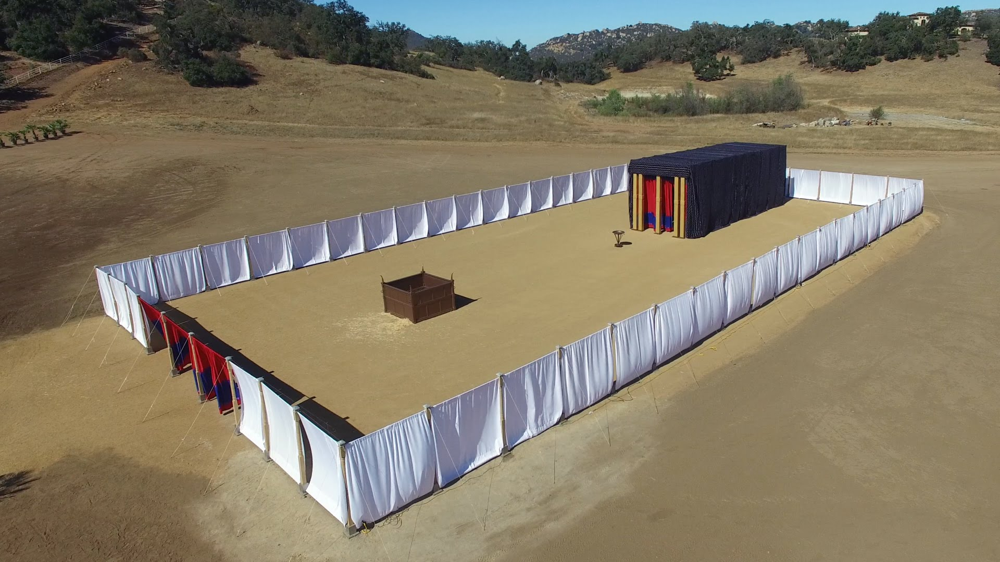

# 出埃及记 38

** 祭坛 **  
38:1 他用皂荚木做燔祭坛，是四方的，长五肘，宽五肘，高三肘。  
38:2 在坛的四拐角上做四个角，与坛接连一块，用铜把坛包裹。
- 在大祭司承接圣职的仪式中（利八15；九19） 、 赎罪祭 （利四18）和赎罪日（利十六18 ） ， 祭司都要用血抹在这四个角上，用以洁净坛， 并象征献祭的果效长远留存。

38:3 他做坛上的盆、铲子、盘子、肉叉子、火鼎；这一切器具都是用铜做的。  
38:4 又为坛做一个铜网，安在坛四面的围腰板以下，从下达到坛的半腰。  
38:5 为铜网的四角铸四个环子，作为穿杠的用处。  
38:6 用皂荚木做杠，用铜包裹。  
38:7 把杠穿在坛两旁的环子内，用以抬坛。并用板做坛，坛是空的。  
- 建造燔祭坛的过程，完全遵照二十七1-8节神在山上的指示.
>
27:1 你要用皂荚木做坛，这坛要四方的，长五肘，宽五肘，高三肘。  
27:2 要在坛的四拐角上做四个角，与坛接连一块，用铜把坛包裹。  
27:3 要做盆，收去坛上的灰，又做铲子、盘子、肉叉子、火鼎；坛上一切的器具都用铜做。　  
27:4 要为坛做一个铜网，在网的四角上做四个铜环。  
27:5 把网安在坛四面的围腰板以下，使网从下达到坛的半腰。  
27:6 又要用皂荚木为坛作杠，用铜包裹。  
27:7 这杠要穿在坛两旁的环子内，用以抬坛。  
27:8 要用板做坛，坛是空的，都照着在山上指示你的样式做。  

- 铜祭坛长2.25米，宽2.25米，高1.35米，是会幕中最大的物件。
- 铜祭坛： 献祭赎罪；凡到祭坛这里来的人，只要不是故意杀人，都能得着拯救。
> 【王上1：50】亚多尼雅惧怕所罗门，就起来，去抓住祭坛的角。  
> 【出21:14】人若任意用诡计杀了他的邻舍，就是逃到我的坛那里，也当捉去把他治死。  

问题：
- 为什么说铜祭坛既满足神公义的要求，又是神恩典的出口?
  - 铜」象征审判。铜祭坛和坛上的一切用具都是用铜做的，表明了神公义的要求。没有祭牲的祭坛显明了神的公义和审判。
  - 罪人在神面前是站立不住的, 因此神预备了铜祭坛来解决人的难处。當祭牲完全被燒在坛上，贖去人的罪孽，當罪被除去人才可進入「聖所」與神相會。
  - 人一进入会幕，首先就遇到铜祭坛所代表的神的公义要求，但也首先接受了铜祭坛所表明的神的赦免恩典。
  - 基督成为赎罪的羔羊，用自己的死滿足了神的公義,所以無論是誰只要靠著他就能親近神。

** 造浴盆 **  
38:8 他用铜做洗濯盆和盆座，是用会幕门前伺候的妇人之镜子做的。  
- 建造洗濯盆和盆座的过程，完全遵照三十18节神在山上的指示.
> 30:18 “你要用铜做洗濯盆和盆座，以便洗濯。要将盆放在会幕和坛的中间，在盆里盛水。

- 古代以铜为镜.
- 祭司在承接圣职时一次「用水洗身」（二十九4）还不够，每天进会幕或献祭之前，还需要在铜做的「洗濯盆」里「洗手洗脚」.
- 每一個進入內院的人，都必須裡裡外外都被對付，先是銅祭壇，再而是洗濯盆。

问题：
- 洗濯盆的属灵意义?
  - 奉献：她們把自己的鏡子獻上作盆,說明重視神的帳幕超過重視自己的打扮, 愛神勝過愛自己，體現了為事奉神而捨己的精神。
  - 属灵装饰：她們注重心靈（属灵的装饰）勝過外表的妝飾（彼前3:1-5）。我们不能忽略外表而忽略掉内心对神的敬畏和纯净。
  > (彼前三3-4)   
  > 3:3 你们不要以外面的辫头发、戴金饰、穿美衣为妆饰，  
  > 3:4 只要以里面存着长久温柔、安静的心为妆饰，这在神面前是极宝贵的。  

  - 事奉的人应当每天在神的话语面前省察自己、洁净自己。

- 您要鏡子還是銅盆？你是否愿意把生命当中的镜子为神所献上呢?  
  - 镜子可以照出人的样貌，但镜子无法更新我们的生命；可以显露污点，但无法把它除掉。铜盆里的水可以除去脸上的污秽，洁净我们的生命，同時亦如鏡子反照我們的生命。懂得把镜子变成铜盆，代表我们愿意把世上的东西分别为圣，为上帝所用；愿意注重心灵胜过外表的装饰；愿意每天“洗手洗脚”，用神的话省察自己、洁净自己。

** 外院 **  
38:9 他做帐幕的院子，院子的南面，用捻的细麻做帷子，宽一百肘。
38:10 帷子的柱子二十根，带卯的铜座二十个，柱子上的钩子和杆子都是用银子做的。  
38:11 北面也有帷子，宽一百肘。帷子的柱子二十根，带卯的铜座二十个，柱子上的钩子和杆子都是用银子做的。  
38:12 院子的西面有帷子，宽五十肘。帷子的柱子十根，带卯的座十个，柱子的钩子和杆子都是用银子做的。  
38:13 院子的东面，宽五十肘。
- 用捻的细麻做帷子： 一种白色的帘子。  
- 會幕的院子南北長45米,東西寬22.5米。

38:14,15 门这边的帷子十五肘，那边也是一样。帷子的柱子三根，带卯的座三个。在门的左右各有帷子十五肘，帷子的柱子三根，带卯的座三个。  
38:16 院子四面的帷子，都是用捻的细麻做的。  
38:17 柱子带卯的座是铜的，柱子上的钩子和杆子是银的，柱顶是用银子包的。院子一切的柱子都是用银杆连络的。　  
- 帳幕的柱頂是用金子包的（三十六38）

38:18 院子的门廉是以绣花的手工，用蓝色、紫色、朱红色线和捻的细麻织的，宽二十肘，高五肘，与院子的帷子相配。  
38:19 帷子的柱子四根，带卯的铜座四个，柱子上的钩子和杆子是银的，柱顶是用银子包的。  
38:20 帐幕一切的橛子和院子四围的橛子都是铜的。  
- 建造帐幕的院子的过程，完全遵照二十七9-19节神在山上的指示.
> 27:9 你要做帐幕的院子，院子的南面要用捻的细麻做帷子，长一百肘。  
27:10 帷子的柱子要二十根，带卯的铜座二十个，柱子上的钩子和杆子都要用银子做。  
27:11 北面也当有帷子，长一百肘，帷子的柱子二十根，带卯的铜座二十个，柱子上的钩子和杆子都要用银子做。  
27:12 院子的西面当有帷子，宽五十肘。帷子的柱子十根，带卯的座十个。  
27:13 院子的东面要宽五十肘。  
27:14 门这边的帷子要十五肘，帷子的柱子三根，带卯的座三个；  
27:15 门那边的帷子也要十五肘，帷子的柱子三根，带卯的座三个。  
27:16 院子的门当有廉子，长二十肘，要拿蓝色、紫色、朱红色线和捻的细麻，用绣花的手工织成，柱子四根，带卯的座四个。  
27:17 院子四围一切的柱子都要用银杆连络，柱子上的钩子要用银做，带卯的座要用铜做。  
27:18 院子要长一百肘，宽五十肘，高五肘，帷子要用捻的细麻做，带卯的座要用铜做。  
27:19 帐幕各样用处的器具，并帐幕一切的橛子和院子里一切的橛子都要用铜做。  

- 银：
  - 圣所带卯的座，和幔子柱子带卯的座: 100个
  - 柱子上的钩子和杆子；柱顶
- 铜：
  - 祭坛和洗濯盆
  - 带卯的铜座：60个
  - 帐幕一切的橛子和院子四围的橛子  

帐幕的院子的属灵意义：  
帐幕是神与他们同住的记号。但人如果他们不进入院子，就不能享用到神所预备的赦免、恩典和荣耀的丰富。今天我们进入「院子」，就是进入基督里。人只有活在基督里，才能享用神为我们所预备的一切丰盛；人若不进到基督里，不管有多少属灵知识，还是被隔绝在神的恩典之外。

** 所用材料 **  
38:21 这是法柜的帐幕中利未人所用物件的总数，是照摩西的吩咐，经祭司亚伦的儿子以他玛的手数点的。  
38:22 凡耶和华所吩咐摩西的，都是犹大支派户珥的孙子、乌利的儿子比撒列做的。    
38:23 与他同工的，有但支派中亚希撒抹的儿子亚何利亚伯；他是雕刻匠，又是巧匠，又能用蓝色、紫色、朱红色线和细麻绣花。  
- 神給我們一個團體理財的法則，收奉獻有專人負責，使用奉獻則是另一個專人。

38:24 为圣所一切工作使用所献的金子，按圣所的平，有二十九他连得并七百三十舍客勒。  
- 29 x 3000 + 730 = 87,730舍客勒 x 11.4克 = 1,000,122克 = 1000公斤 (二十岁以上平均每人奉献了1.66克金子)

38:25 会中被数的人所出的银子，按圣所的平，有一百他连得并一千七百七十五舍客勒。  
38:26 凡过去归那些被数之人的，从二十岁以外，有六十万零三千五百五十人，按圣所的平，每人出银半舍客勒，就是一比加。  
- 100 x 3000 + 1775 = 301,775舍客勒 x 11.4克 = 3,440,235克 = 3440公斤 (二十岁以上平均每人奉献了5.7克银子)
- 这「一百他连得并一千七百七十五舍客勒」（25节）的银子是「赎罪银」(三十11-16)，并不包括自愿奉献的礼物（三十五5）。
> 30:11 耶和华晓谕摩西说：  
30:12 “你要按以色列人被数的计算总数。你数的时候，他们各人要为自己的生命把赎价奉给耶和华，免得数的时候在他们中间有灾殃。  
30:13 凡过去归那些被数之人的，每人要按圣所的平，拿银子半舍客勒，这半舍客勒是奉给耶和华的礼物。一舍客勒是二十季拉。  
30:14 凡过去归那些被数的人，从二十岁以外的，要将这礼物奉给耶和华。  
30:15 他们为赎生命将礼物奉给耶和华，富足的不可多出，贫穷的也不可少出，各人要出半舍客勒。  
30:16 你要从以色列人收这赎罪银，作为会幕的使用，可以在耶和华面前为以色列人作记念，赎生命。”  

- 「比加」是最小的砝码石，表明20岁以上的以色列男人每人只交「一比加」赎罪银，是最小的数目。「一比加」大约是5.7克。

38:27 用那一百他连得银子铸造圣所带卯的座，和幔子柱子带卯的座，一百他连得共一百带卯的座；每带卯的座用一他连得。  
38:28 用那一千七百七十五舍客勒银子做柱子上的钩子，包裹柱顶并柱子上的杆子。  

38:29 所献的铜，有七十他连得并二千四百舍客勒。
- 百姓总共奉献了大约2421公斤的铜.

38:30 用这铜做会幕门带卯的座和铜坛，并坛上的铜网和坛的一切器具，  
38:31 并院子四围带卯的座和院门带卯的座，与帐幕一切的橛子和院子四围所有的橛子。  

- 会幕在「第二年正月初一日」（四十17）之前就建好了，但「第二年二月初一日」（民一1）才开始点算人数，之后才知道「从二十岁以外，能出去打仗、被数的，共有六十万零三千五百五十名」（民一46）。
> 出40:17 第二年正月初一日，帐幕就立起来。  
> 民1:1 以色列人出埃及地后，第二年二月初一日，耶和华在西奈的旷野、会幕中晓谕摩西说：  
民1:2 “你要按以色列全会众的家室、宗族、人名的数目，计算所有的男丁。  

祷告：  
求主光照我們，給我們一顆謙卑的心，願意被煉淨，成為器皿。求主除去我們生命中一切錯誤的做法，讓我們行事為人都有屬主的樣式。透过祭坛提醒我们耶稣是赎罪的羔羊；透过洗濯盆看到，当我们放下自己的时候，好叫圣洁的生命、圣洁的神在我们生命当中彰显出来。求主幫助我們，每天到銅祭壇前擺上自己，每天在洗濯盆前決心過聖潔的生活。

# Reference
- [出埃及记第38章逐节注解、祷读/](https://cmcbiblereading.com/2015/03/26/%E5%87%BA%E5%9F%83%E5%8F%8A%E8%AE%B0%E7%AC%AC38%E7%AB%A0%E9%80%90%E8%8A%82%E6%B3%A8%E8%A7%A3%E3%80%81%E7%A5%B7%E8%AF%BB/)
- 帐幕  

- 铜祭坛和铜网示意图
- 铜祭坛和帐幕的院子

