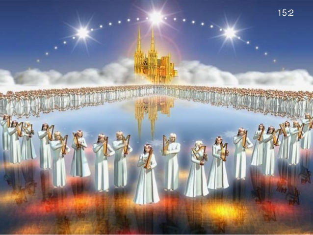

# 经文
```
15:1 我又看见在天上有异象，大而且奇，就是七位天使掌管末了的七灾，因为神的大怒在这七灾中发尽了。
15:2 我看见彷佛有玻璃海，其中有火搀杂。又看见那些胜了兽和兽的像，并它名字数目的人，都站在玻璃海上，拿着神的琴，
15:3 唱神仆人摩西的歌和羔羊的歌，说：“主神，全能者啊，你的作为大哉，奇哉！万世之王啊（注：“世”或作“国”），你的道途义哉，诚哉！
15:4 主啊，谁敢不敬畏你，不将荣耀归与你的名呢？因为独有你是圣的，万民都要来在你面前敬拜，因你公义的作为已经显出来了。”
15:5 此后，我看见在天上那存法柜的殿开了。
15:6 那掌管七灾的七位天使从殿中出来，穿着洁白光明的细麻衣（注：“细麻衣”有古卷作“宝石”），胸间束着金带。
15:7 四活物中有一个把盛满了活到永永远远之　神大怒的七个金碗给了那七位天使。
15:8 因神的荣耀和能力，殿中充满了烟。于是没有人能以进殿，直等到那七位天使所降的七灾完毕了。
```

# 查经
## 主题：准备最后的七灾

> 15:1 我又看见在天上有异象，大而且奇，就是七位天使掌管末了的七灾，因为神的大怒在这七灾中发尽了。  

- 这是第七个异象。`大而且奇`强调这异象的特别。是因神的作为大哉，奇哉！（15:3）  
- 这`末了的七灾`，是在大灾难中最后的‘七灾’。我们已接近大灾难时期的尾声了.  
- 它們就是那只飞在空中的大鷹所說，祸哉！祸哉！祸哉！(8:13)的第三样灾禍(11:14)，也就是第七位天使吹号(11:15)所引进的全部灾禍內容。
  > (第四天使吹号)  
  > 8:13 我又看见一个鹰飞在空中，并听见它大声说：“三位天使要吹那其余的号，你们住在地上的民祸哉！祸哉！祸哉！”  
  > (两个见证人)  
  > 11: 14 第二样灾祸过去，第三样灾祸快到了。  
  > (第七天使吹号)  
  > 11: 15 第七位天使吹号，天上就有大声音说：“世上的国成了我主和主基督的国，他要做王，直到永永远远。”

- `末了的七灾`一方面发尽了(completed)神的大怒；另一方面，乃是成就了(completed)神既定的旨意。我們所遭遇的苦难，往往是因为神要成全我們，造就我們(彼得前书 5:10)
  > 5:9 你们要用坚固的信心抵挡它，因为知道你们在世上的众弟兄也是经历这样的苦难。  
  > 5:10 那赐诸般恩典的神，曾在基督里召你们得享他永远的荣耀，等你们暂受苦难之后，必要亲自成全你们，坚固你们，赐力量给你们。  

- `神的大怒`: 指神歷來因人不肯悔改所積蓄的震怒 (罗马书 2:5)   
  > 2:5 你竟任着你刚硬不悔改的心，为自己积蓄愤怒，以致神震怒，显他公义审判的日子来到。


> 15:2 我看见彷佛有玻璃海，其中有火搀杂。又看见那些胜了兽和兽的像，并它名字数目的人，都站在玻璃海上，拿着神的琴，

- `玻璃海`指神宝座前的玻璃海。（4:6）
  > (天上的宝座)  
  > 4:6 宝座前好像一个玻璃海，如同水晶。宝座中和宝座周围有四个活物，前后遍体都满了眼睛。  

- `火`代表审判。也表明這`末了的七災`，不是用洪水，而是用烈火。
- `又看见那些胜了兽和兽的像，并它名字数目的人`: 这些就是在大灾难期间拒绝敬拜兽或兽的像而殉道的得胜者。然而，现在他们都在天上。
  - 由此可見，在大灾难期中仍陆续有得胜的信徒被提。
  - 错过在大灾难以前被提的人，仍有机会得胜。虽然环境艰难，但只要坚守信仰，便是`胜了兽`的人；这須要忍耐和信心。(13:10；14:12)
    > (任凭兽与圣徒争战)  
    > 13:10 掳掠人的必被掳掠，用刀杀人的必被刀杀。圣徒的忍耐和信心就是在此。  
    > (天使传福音)  
    > 14:12 圣徒的忍耐就在此，他们是守神诫命和耶稣真道的。

- `拿着神的琴`意思是拿着神所赐的琴.
- 艺术想象图: 得胜者们站在有火搀杂的玻璃海上，拿着神的琴


> 15:3 唱神仆人摩西的歌和羔羊的歌，说：“主神，全能者啊，你的作为大哉，奇哉！万世之王啊（注：“世”或作“国”），你的道途义哉，诚哉！

- `摩西的歌`指以色列人过红海之后，摩西站在红海边赞美神施行拯救(拯救他的百姓脱离埃及的奴役)的歌（出埃及 15:1-18）。它代表赞美神审判他的仇敌。
- `羔羊的歌`
  - 这歌（`摩西的歌`）也是`羔羊的歌`，因为神领以色列人过红海出埃及，正是预表羔羊救我们出黑暗入光明。
  - `羔羊的歌`乃称颂羔羊施行拯救，使信他的人得蒙救赎脱离罪恶，它代表赞美基督完成救恩。
  - 这两件事件标志着神的救赎的两端。
- 神的救恩非常完备，消极方面使我們脱离仇敌和罪恶，积极方面使我們得着生命和享受。
- `作为`和`道途`, 是指神对敌基督和他的跟从者的审判。


> 15:4 主啊，谁敢不敬畏你，不将荣耀归与你的名呢？因为独有你是圣的，万民都要来在你面前敬拜，因你公义的作为已经显出来了。”  

- `敬畏你`是与拜兽和兽像（14:11）作对比。`你的名`是与兽名（14:11）作对比。拜兽和兽像，就是不敬畏神；受兽名和它名字數目的印記，就是不将荣耀归于神的名。
  - 邪恶的一方以兽为代表，包括赤龙和假先知以及大淫妇等，他们无恶不作，并且迷惑了许多人，把不明真相的人们打上兽的印记。（14:16）
    > (从地中上来的兽)
    > 14:16 他又叫众人，无论大小贫富，自主的为奴的，都在右手上，或在额上，受一个印记。

  - 站在羔羊一边的人们头上印着羔羊的印记 (14:1)
    > 14:1 我又观看，见羔羊站在锡安山，同他又有十四万四千人，都有他的名，和他父的名写在额上。

  - 跟着兽行恶的人，必将受到神的“最后审判” （14:9-11）
    > (天使传福音）  
    > 14:9 又有第三位天使接着他们大声说：“若有人拜兽和兽像，在额上或在手上受了印记，  
    > 14:10 这人也必喝神大怒的酒，此酒斟在神愤怒的杯中纯一不杂。他要在圣天使和羔羊面前，在火与硫磺之中受痛苦。   
    > 14:11 他受痛苦的烟往上冒，直到永永远远。那些拜兽和兽像，受它名之印记的，昼夜不得安宁。”   


- 「公义的作为」指审判。神在地上施行的审判，已显示他是圣洁的、公义的。他们要使万民都敬畏、荣耀、敬拜他。
- 这些歌（3-4节）的内容几乎全都引自旧约圣经：
    - 「主神」出自 阿摩司书 3:13 。
      > 3:13 主耶和华万军之神说：“当听这话，警戒雅各家。

    - 「祢的作为大哉！奇哉！」出自 诗篇 92:5；111:2，139:14 。
      > 92:5 耶和华啊，你的工作何其大！你的心思极其深！  
      > 111:2 耶和华的作为本为大，凡喜爱的都必考察。  
      > 139:14 我要称谢你，因我受造奇妙可畏；你的作为奇妙，这是我心深知道的。  

    - 「万世之王啊」出自 耶利米书 10:7 。
      > 10:7 万国的王啊，谁不敬畏你？敬畏你本是合宜的，因为在列国的智慧人中，虽有政权的尊荣，也不能比你。

    - 「祢的道途义哉！诚哉！」出自 申命记 32:4，诗篇 145:17 。
      > 32:4 他是磐石，他的作为完全，他所行的无不公平，是诚实无伪的神，又公义又正直。  
      > 145:17 耶和华在他一切所行的无不公义，在他一切所做的都有慈爱。

    - 「主啊，谁敢不敬畏祢」出自 耶利米书 10:7 。
      > 10:7 万国的王啊，谁不敬畏你？敬畏你本是合宜的，因为在列国的智慧人中，虽有政权的尊荣，也不能比你。

    - 「不将荣耀归与祢的名」出自 诗篇 86:9 。
    > 86:9 主啊，你所造的万民都要来敬拜你，他们也要荣耀你的名。

    - 「因为独有祢是圣的」出自 撒母耳记上 2:2。
    > 2:2 只有耶和华为圣，除他以外没有可比的，也没有磐石像我们的神.

    - 「万民都要来在祢面前敬拜」出自 以赛亚书 2:2-3，耶利米书 16:19 。
    > 2:2 末后的日子，耶和华殿的山必坚立超乎诸山，高举过于万岭，万民都要流归这山。 2:3 必有许多国的民前往，说：“来吧！我们登耶和华的山，奔雅各神的殿。主必将他的道教训我们，我们也要行他的路，因为训诲必出于锡安，耶和华的言语必出于耶路撒冷。”  
    > 16:19 耶和华啊，你是我的力量，是我的保障，在苦难之日是我的避难所。列国人必从地极来到你这里，说：“我们列祖所承受的不过是虚假，是虚空无益之物。

    - 「因祢公义的作为已经显出来了」出自 耶利米书 11:20，诗 98:2 。
    > 11:20 按公义判断，察验人肺腑心肠的万军之耶和华啊，我却要见你在他们身上报仇，因我将我的案件向你禀明了。  
    > 98:2 耶和华发明了他的救恩，在列邦人眼前显出公义。


> 15:5 此后，我看见在天上那存法柜的殿开了。After this I looked and in heaven the temple, that is, `the tabernacle of the Testimony(证言的帐幕)`, was opened.  

- 这异象到了`神天上的殿开了，在祂殿中现出祂的约柜`（11:19）的那一刻。
  > 11:19 当时，神天上的殿开了，在他殿中现出他的约柜，随后有闪电、声音、雷轰、地震、大雹。Then God's temple in heaven was opened, and within his temple was seen the `ark of his covenant（盟约)`. And there came flashes of lightning, rumblings, peals of thunder, an earthquake and a great hailstorm.

- `法柜`: 原文是'见证的柜'。
- `殿`: 神在此施行审判。
- 联想到以色列人在旷野時那`有法柜的帐幕`(使徒行传 7:44)。神乃是信实守约的神。他在施行审判之時，仍记念到他与以色列人所立的约。
  > (司提反当众申诉)  
  > 7:44 我们的祖宗在旷野有法柜的帐幕，是神吩咐摩西叫他照所看见的样式做的。

- 地上的殿只是模型或仿制品而已（希伯来书 9:23）
  > (耶稣一次献上自己成了永远赎罪的祭)  
  > 9:23 照着天上样式做的物件必须用这些祭物去洁净，但那天上的本物自然当用更美的祭物去洁净.

- `天上那存法柜的殿开了`: 神已预备好要行动了，可是我們信徒预备好了吗？


> 15:6 那掌管七灾的七位天使从殿中出来，穿着洁白光明的细麻衣（注：“细麻衣”有古卷作“宝石”），胸间束着金带。  

- `從殿中出來`表示神的命令已经发出，七位天使就要展开行动了。
- `洁白光明的细麻衣`: 象征洁白无瑕，表明七碗大怒的来源是圣洁的，不是兽发出的烈怒，而是圣洁、公义的审判。
- 这些天使已准备好，要执行神公义的审判，施行最后的七灾。神会因这些审判而得荣耀。  


> 15:7 四活物中有一个把盛满了活到永永远远之神大怒的七个金碗给了那七位天使。

- `四活物`：
  - 有多种解释。其一：他們代表一切受造之物中的活物。
  > 4:6-8 (天上的宝座)  
  > 4:6 宝座前好像一个玻璃海，如同水晶。宝座中和宝座周围有四个活物，前后遍体都满了眼睛。   
  > 4:7 第一个活物像狮子，第二个像牛犊，第三个脸面像人，第四个像飞鹰。   
  > 4:8 四活物各有六个翅膀，遍体内外都满了眼睛。他们昼夜不住地说：“圣哉，圣哉，圣哉，主神是昔在、今在、以后永在的全能者！”  
  >
  > 以西结书 1:5-6 (见四活物)  
  > 1:5 又从其中显出四个活物的形象来，他们的形状是这样：有人的形象，
  > 1:6 各有四个脸面、四个翅膀。

  - 在揭开头四印時，都由他們出面。此刻即将执行第七印中的第七号时，仍由他們中的一个出面。

- `活到永永远远之神`：神是活到永永远远之神。审判的后果也是直到永永远远（所施的刑罚将給受刑者受痛苦直到永永远远）。(20:10)
  > 20:10 那迷惑他们的魔鬼被扔在硫磺的火湖里，就是兽和假先知所在的地方。他们必昼夜受痛苦，直到永永远远。

- 兽只被允许`任意而行四十二个月`（13:5）
  > 13:5 又赐给它说夸大亵渎话的口，又有权柄赐给它，可以任意而行四十二个月。

- `金碗（golden bowls）`：原文与二十四位长老所拿盛满了众圣徒祈祷的`金炉 (golden bowls)`（5:8）相同，表明七碗之灾是神对众圣徒祷告的回应。  
  > (书卷和羔羊)  
  > 5:8 他既拿了书卷，四活物和二十四位长老就俯伏在羔羊面前，各拿着琴和盛满了香的金炉。这香就是众圣徒的祈祷。   
  > 5:9 他们唱新歌，说：“你配拿书卷，配揭开七印，因为你曾被杀，用自己的血从各族、各方、各民、各国中买了人来，叫他们归于神，   
  > 5:10 又叫他们成为国民做祭司，归于神，在地上执掌王权。”  


> 15:8 因神的荣耀和能力，殿中充满了烟。于是没有人能以进殿，直等到那七位天使所降的七灾完毕了。

- `殿中充满了烟`：彰显神的荣耀。（一说神的震怒达于极点）
  - 出埃及 40:34-35 (耶和华之荣光充盈会幕)
  > 34 当时，云彩遮盖会幕，耶和华的荣光就充满了帐幕。   
  > 35 摩西不能进会幕，因为云彩停在其上，并且耶和华的荣光充满了帐幕。

  - 列王紀上 8:10-11 (运约柜入殿)
  > 10 祭司从圣所出来的时候，有云充满耶和华的殿，   
  > 11 甚至祭司不能站立供职，因为耶和华的荣光充满了殿。

  - 以赛亚书 6:3-4 (以赛亚得见主荣)
  > 3 彼此呼喊说：“圣哉，圣哉，圣哉，万军之耶和华！他的荣光充满全地！”  
  > 4 因呼喊者的声音，门槛的根基震动，殿充满了烟云。

  - 以西结书 10:3-4 (见火炭)
  > 3 那人进去的时候，基路伯站在殿的右边，云彩充满了内院。  
  > 4 耶和华的荣耀从基路伯那里上升，停在门槛以上。殿内满了云彩，院宇也被耶和华荣耀的光辉充满。

  - 以西结书 44:4 (见主荣光充满圣殿)
  > 4 他又带我由北门来到殿前。我观看，见耶和华的荣光充满耶和华的殿，我就俯伏在地。

- `没有人能以进殿，直等到那七位天使所降的七灾完毕了`：表示已经没有祭司可以进殿代求，神最后的审判绝不迟延，因为宽容罪人悔改的机会已经结束了。
- 神的宽容忍耐是有限度的，如果我们一再无视悔改的机会，总有一天就不再有机会了。


# Major References
- http://www.jonahome.net/files/bible/new/66_revelation/chapter16.html
- https://cmcbiblereading.com/2015/01/20/%E5%90%AF%E7%A4%BA%E5%BD%95%E7%AC%AC15%E7%AB%A0%E9%80%90%E8%8A%82%E6%B3%A8%E8%A7%A3%E3%80%81%E7%A5%B7%E8%AF%BB/
- http://ccbiblestudy.net/New%20Testament/66Rev/66CT15.htm
