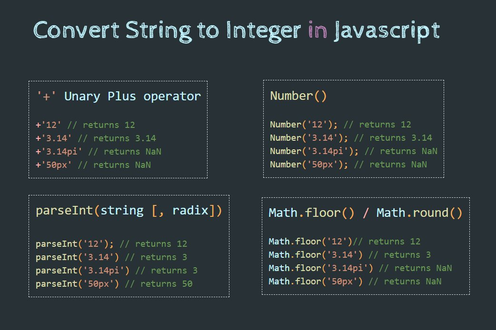
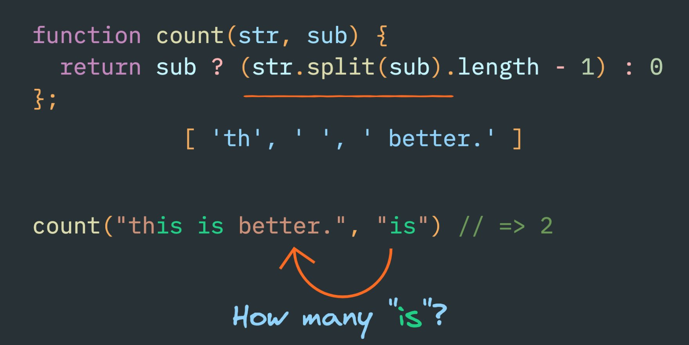

# Receipts
- [How to convert a string to an integer](https://twitter.com/saraogipraveen/status/1302502819577044993/photo/1  )  

- [Occurrences of substring inside another string](https://twitter.com/profulsadangi/status/1304621069651726336/photo/1)

# References
- [MDN: JavaScript data types and data structures](https://developer.mozilla.org/en-US/docs/Web/JavaScript/Data_structures)
